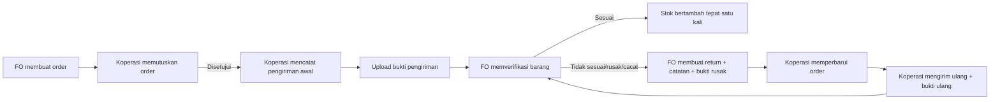
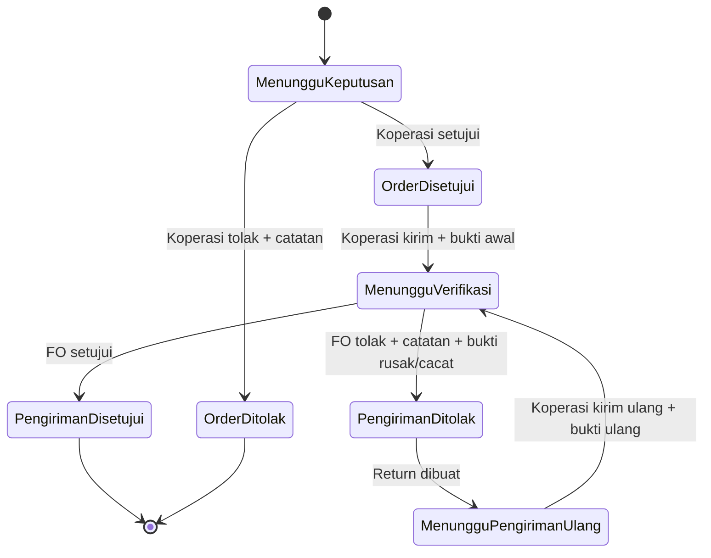
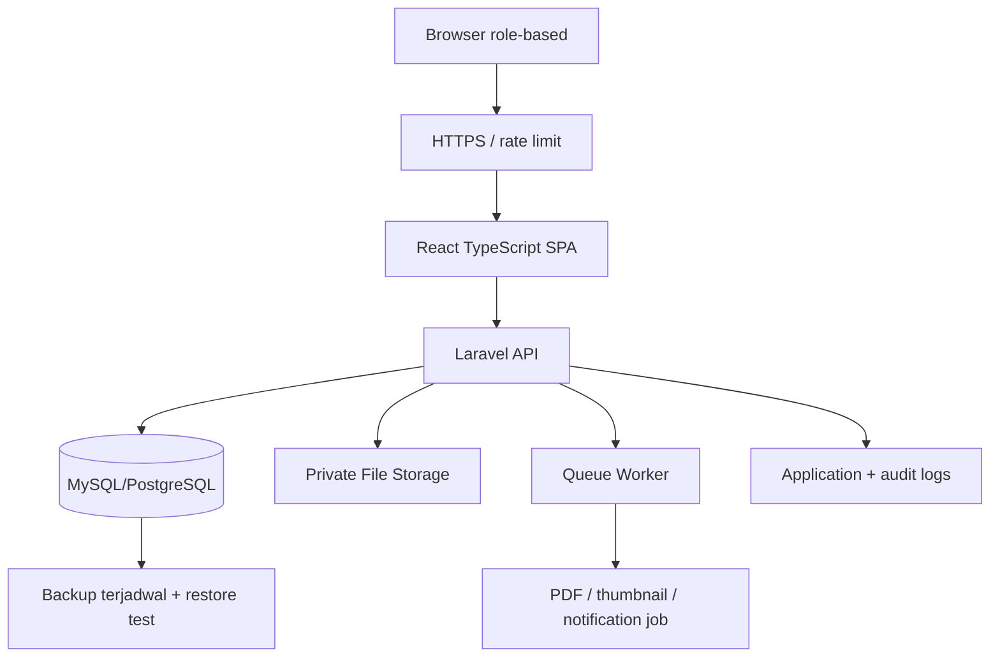

# Next Implementation Plan
## Sistem Informasi Penjualan Suku Cadang dan Jasa Service UPJ Otomotif & AHASS BLPT DIY

**Versi dokumen:** 1.0  
**Tanggal:** 29 Juli 2026  
**Status:** Rencana pengembangan setelah implementasi awal  
**Tujuan:** Menjadikan aplikasi siap untuk demonstrasi sidang, layak menjadi portofolio teknis, dan memiliki fondasi yang aman serta dapat dikembangkan untuk pilot di lingkungan BLPT DIY.

---

## 1. Ringkasan Eksekutif

Implementasi awal telah memenuhi alur operasional inti: autentikasi empat role, transaksi jasa dan suku cadang, nota, stok minimum, order, keputusan Koperasi, pencatatan penerimaan, serta verifikasi Front Office. Berdasarkan `implementation_clear.md`, tingkat penyelesaian sebelumnya diperkirakan sekitar 90% dan sistem sudah layak digunakan untuk demonstrasi dasar.

Tahap berikutnya tidak boleh diperlakukan sebagai penambahan menu semata. Sistem perlu ditingkatkan dari alur **order–penerimaan** menjadi alur yang dapat ditelusuri secara penuh:



Prioritas tertinggi bukan hanya modul Return Suku Cadang. Sebelum sistem ditunjukkan ke institusi atau dipublikasikan sebagai portofolio, ada celah keamanan dan integritas data yang harus ditutup, terutama route debug/migrasi publik, kebocoran detail exception, idempotensi verifikasi pengiriman, dan pagination yang belum terukur.

Dokumen ini memisahkan pekerjaan menjadi tiga horizon agar jelas:

| Horizon | Target | Fokus |
|---|---|---|
| **P0 — Sidang / demo aman** | Sebelum demo eksternal | Menutup risiko kritis, menyiapkan skenario demo dan bukti pengujian |
| **P1 — Rilis Return** | Sesudah sidang | Return, bukti file, pengiriman ulang, laporan dan migrasi data |
| **P2 — Pilot BLPT** | Sebelum ditawarkan sebagai pilot | Audit trail, backup, observabilitas, keamanan operasional, performa |

---

## 2. Sumber Acuan dan Status Temuan

Dokumen ini disusun dari:

1. `PRD_RANCANGAN_SISTEM_UPJ_AHASS_BLPT_DIY.md` versi 2.0;
2. `implementation_clear.md`;
3. peninjauan ulang source-code Laravel dan React pada 29 Juli 2026;
4. flow terbaru yang menambahkan **Return Suku Cadang**, **Bukti Pengiriman**, dan **Pengiriman Ulang**.

### 2.1 Temuan yang sudah terverifikasi dari source-code

| Area | Status aktual | Dampak terhadap rencana |
|---|---|---|
| Pemisahan akun | Tabel `users` dan `logins` sudah terpisah. `UserController` membuat kedua record dalam satu database transaction. | Bukan pekerjaan migrasi besar; cukup perbaikan UX, audit, dan error handling. |
| Stok transaksi penjualan | `TransactionController::store()` sudah memakai `DB::beginTransaction()` dan `lockForUpdate()` pada stok. | Klaim audit lama tentang row lock transaksi perlu diperbarui menjadi **sudah terpenuhi**. Tetap perlu uji concurrency. |
| PDF laporan | `ReportController` sudah dapat membentuk DomPDF dengan query `?export=pdf`, tetapi UI laporan masih memanggil `window.print()`. | Pekerjaan frontend dan route contract, bukan membangun generator PDF dari nol. |
| Riwayat login | `login_logs` sudah ada dan login mencatat aktivitas. | Tambahkan halaman/laporan Admin dan kebijakan retensi; tidak perlu membuat tabel lagi. |
| Verifikasi penerimaan | Stok dikunci saat kenaikan stok, tetapi record penerimaan tidak diambil dengan lock dan status tidak diperiksa ulang di dalam lock. | Risiko persetujuan paralel dan stok ganda. Harus diperbaiki sebagai bagian P0/P1. |
| Pagination | Beberapa endpoint menggunakan default `per_page=1000`. | Tidak sesuai target PRD dan tidak scalable untuk data BLPT. |

### 2.2 Temuan kritis yang harus ditutup sebelum eksposur eksternal

| ID | Temuan | Bukti lokasi | Risiko | Prioritas |
|---|---|---|---|---|
| SEC-01 | Endpoint `debug-db` mengembalikan host database, hash password, dan hasil autentikasi contoh. | `backend/routes/api.php` | Kebocoran informasi sensitif dan membantu serangan. | P0 — Kritis |
| SEC-02 | Endpoint `run-migrate` dapat menjalankan migration melalui HTTP tanpa autentikasi. | `backend/routes/api.php` | Perubahan skema/kerusakan data dari pihak tidak berwenang. | P0 — Kritis |
| SEC-03 | Respons error pembuatan/update user menampilkan pesan exception, file, dan nomor baris. | `UserController` | Membuka struktur internal aplikasi. | P0 — Tinggi |
| DATA-01 | Verifikasi penerimaan belum mengunci record penerimaan sebelum memeriksa status final. | `SparePartReceiptController::verification()` | Dua request paralel dapat berisiko mencatat kenaikan stok lebih dari sekali. | P0 — Tinggi |
| PERF-01 | List user, order, penerimaan, dan transaksi mengambil hingga 1.000 baris per request. | Beberapa controller API | Lambat saat data bertambah, UI sulit dipakai. | P1 — Tinggi |
| AUTH-01 | Pembatasan route transaksi dibaca oleh Koperasi dan Kepala UPJ lebih luas dari kebutuhan minimal PRD. | `routes/api.php` | Risiko akses data berlebih. | P1 — Sedang |
| DATA-02 | Pengiriman/penerimaan saat ini belum menyimpan identitas Koperasi pengirim dan Front Office verifikator secara eksplisit. | migration `spare_part_receipts` | Audit proses tidak lengkap. | P1 — Tinggi |

> **Aturan rilis:** sistem tidak boleh ditawarkan sebagai sistem institusional sebelum SEC-01, SEC-02, SEC-03, dan DATA-01 dibereskan serta diuji ulang.

---

## 3. Keputusan Produk dan Batas Scope

### 3.1 Terminologi yang digunakan mulai rilis berikutnya

Nama bisnis yang dipakai di UI, API baru, laporan, diagram, dan dokumentasi:

| Istilah lama | Istilah target | Makna |
|---|---|---|
| Penerimaan Suku Cadang | **Pengiriman Suku Cadang** | Pengiriman barang oleh Koperasi terhadap order yang telah disetujui. |
| Verifikasi Penerimaan | **Verifikasi Pengiriman** | Pemeriksaan jumlah, jenis, dan kondisi barang oleh Front Office. |
| Penerimaan ditolak | **Pengiriman ditolak dan dibuat Return** | Barang tidak sesuai/rusak/cacat tidak menambah stok. |
| Bukti Penerimaan | **Bukti Pengiriman** | Dokumen/foto pengiriman awal, bukti rusak/cacat, atau bukti pengiriman ulang. |

Istilah lama boleh dipertahankan hanya sebagai **compatibility label** untuk data historis selama migrasi. Setelah cutover, menu baru tidak memakai kata “penerimaan” untuk proses yang dilakukan Koperasi.

### 3.2 Kebijakan bisnis rilis Return v1

Untuk menjaga kesesuaian dengan flowchart dan menghindari perubahan struktur order multi-item yang belum masuk scope skripsi, rilis Return v1 menggunakan kebijakan berikut:

1. Satu order merepresentasikan satu kebutuhan suku cadang seperti model implementasi saat ini.
2. Satu pengiriman awal yang tidak sesuai akan **ditolak seluruhnya**; stok tidak berubah.
3. Front Office wajib menyimpan catatan penolakan dan minimal satu bukti barang rusak/cacat saat menolak.
4. Koperasi membuat pengiriman ulang dari return yang sama, bukan membuat order baru tanpa relasi.
5. Pengiriman ulang wajib memiliki bukti pengiriman ulang.
6. Stok hanya bertambah ketika pengiriman awal atau pengiriman ulang berstatus `disetujui`, dan hanya sekali untuk satu pengiriman.
7. Penerimaan/pengiriman parsial dan multi-item header-detail menjadi **P2** setelah kebutuhan BLPT dipastikan. Jangan dicampurkan ke rilis Return v1.

### 3.3 Di luar scope rilis Return v1

- Integrasi ke API AHASS atau koperasi eksternal.
- Marketplace/e-commerce dan pembayaran digital.
- Akuntansi, HPP, margin, komisi, maupun payroll.
- OCR dokumen atau pemeriksaan foto otomatis.
- Aplikasi mobile native.
- Purchase order multi-item dan partial delivery; ini hanya kandidat P2.

---

## 4. P0 — Kesiapan Sidang dan Keamanan Dasar

P0 adalah pekerjaan wajib yang kecil ruang lingkupnya, mudah diverifikasi, dan bernilai tinggi untuk demo maupun portofolio. P0 tidak menunggu modul Return selesai.

### 4.1 Hapus route maintenance/debug dari production

**Tindakan:**

1. Hapus `GET /api/v1/debug-db` dan `GET /api/v1/run-migrate` dari `backend/routes/api.php`.
2. Migration hanya dijalankan melalui CLI, CI/CD, atau proses deploy yang diautentikasi; tidak pernah melalui endpoint HTTP publik.
3. Pastikan `.env` production memiliki `APP_ENV=production` dan `APP_DEBUG=false`.
4. Rotasi kredensial database bila endpoint tersebut pernah terdeploy publik.
5. Tambahkan pemeriksaan CI sederhana yang gagal bila source mengandung route debug/migrasi publik.

**Acceptance criteria:**

- Request ke kedua route menghasilkan 404.
- Tidak ada hash password, host database, stack trace, atau secret dalam respons API.
- Migration production hanya dapat dilakukan dari pipeline/deployer yang berwenang.

### 4.2 Perbaiki error handling API

**Tindakan:**

- Ganti respons exception mentah pada `UserController` dan controller lain menjadi pesan generik, misalnya `Terjadi kesalahan saat menyimpan data.`
- Simpan detail exception hanya di `storage/logs` dengan correlation/request ID.
- Bentuk respons error mengikuti kontrak API yang konsisten: `success`, `message`, dan `errors` untuk validasi.
- Tambahkan error boundary di React untuk kegagalan tak terduga; jangan tampilkan stack trace ke pengguna.

**Acceptance criteria:**

- Respons HTTP 500 tidak berisi file path, line number, SQL, token, atau password hash.
- Log server tetap cukup untuk diagnosis oleh developer.

### 4.3 Kunci dan idempotensikan verifikasi stok

`lockForUpdate()` pada transaksi penjualan sudah benar. Pola yang sama harus diterapkan pada verifikasi pengiriman.

**Algoritme target:**

```text
DB::transaction(function () use ($shipmentId, $command) {
  shipment = Shipment::whereKey($shipmentId)->lockForUpdate()->firstOrFail();

  reject jika shipment.status bukan menunggu_verifikasi;
  validasi transisi status dan aturan bukti;

  jika disetujui:
    stock = SparePartStock::where(spare_part_id)->lockForUpdate()->firstOrFail();
    stock.stok_sekarang += shipment.jumlah;
    stock.save();
    shipment.stock_posted_at = now();

  shipment.status = hasil_verifikasi;
  shipment.verified_by = current_user_id;
  shipment.verified_at = now();
  shipment.save();
});
```

**Acceptance criteria:**

- Dua request persetujuan paralel terhadap pengiriman yang sama menghasilkan tepat satu HTTP 200 dan satu HTTP 409/422.
- Stok bertambah tepat satu kali.
- Request ulang dengan idempotency key yang sama mengembalikan hasil sebelumnya tanpa mutasi kedua.

### 4.4 Siapkan paket demo sidang

Skenario demo harus memakai data seed yang konsisten, bukan input spontan.

| Urutan | Aksi demo | Bukti yang ditunjukkan |
|---|---|---|
| 1 | Login sebagai Front Office | Role-based menu dan dashboard |
| 2 | Buat transaksi jasa + suku cadang | Nota dan stok berkurang |
| 3 | Tampilkan notifikasi stok minimum | Kartu/daftar stok minimum |
| 4 | Buat order | Status `menunggu` |
| 5 | Login Koperasi, setujui order | Status order berubah |
| 6 | Buat pengiriman + upload bukti | Bukti pengiriman tercatat |
| 7 | Login Front Office, tolak karena rusak/cacat | Catatan dan bukti rusak muncul; stok tidak berubah |
| 8 | Login Koperasi, kirim ulang + bukti ulang | Return terhubung ke pengiriman ulang |
| 9 | Front Office setujui pengiriman ulang | Stok bertambah sekali |
| 10 | Login Kepala UPJ | Laporan periode dan ekspor PDF server-side |

Simpan screenshot tiap langkah, hasil API, serta hasil test untuk BAB IV dan portofolio.

---

## 5. P1 — Modul Return Suku Cadang dan Bukti Pengiriman

### 5.1 Modul yang dibangun

| Modul | Pengguna utama | Nilai bisnis |
|---|---|---|
| Pengiriman Suku Cadang | Koperasi | Pengiriman dari order disetujui dan bukti pengiriman awal terdokumentasi. |
| Verifikasi Pengiriman | Front Office | Barang dicek sebelum stok berubah. |
| Return Suku Cadang | Front Office dan Koperasi | Penolakan, alasan, bukti rusak/cacat, dan tindak lanjut tidak hilang. |
| Pengiriman Ulang | Koperasi | Pengganti barang ditautkan ke return, bukan dicatat sebagai transaksi baru terpisah. |
| Bukti Pengiriman | Koperasi dan Front Office | Bukti awal, kerusakan, dan pengiriman ulang dapat dilihat sesuai hak akses. |
| Riwayat Pengiriman & Return | Koperasi, FO, Kepala UPJ terbatas | Audit status dan dokumen per order. |

### 5.2 State machine yang harus dikunci backend

Backend, bukan frontend, adalah sumber kebenaran status.



**Larangan transisi:**

- Order yang sudah ditolak tidak boleh langsung memiliki pengiriman.
- Pengiriman tidak boleh disetujui/ditolak dua kali.
- Return tidak boleh dibuat dari pengiriman yang belum ditolak.
- Pengiriman ulang tidak boleh dibuat jika return belum berstatus menunggu pengiriman ulang.
- Bukti kerusakan tidak boleh dipakai untuk pengiriman yang berbeda.
- Penghapusan record final diganti dengan pembatalan/audit, bukan hard delete.

### 5.3 Struktur database target

Nama tabel berikut memakai istilah domain target. Bila aplikasi belum pernah dipakai produksi, rekomendasinya adalah melakukan rename/cutover sebelum rilis. Bila sudah menyimpan data operasional, gunakan strategi migrasi pada bagian 6.

#### `spare_part_shipments`

| Kolom | Tipe/constraint | Tujuan |
|---|---|---|
| `id` | PK | Identitas pengiriman |
| `spare_part_order_id` | FK, NOT NULL | Order sumber |
| `shipment_type` | enum `initial`, `replacement` | Membedakan kirim awal dan kirim ulang |
| `quantity` | unsigned integer, > 0 | Jumlah dikirim |
| `status` | enum/status terpusat | `menunggu_verifikasi`, `disetujui`, `ditolak` |
| `shipped_by` | FK `users`, NOT NULL | Koperasi yang mencatat pengiriman |
| `shipped_at` | timestamp | Waktu pengiriman diajukan |
| `verified_by` | FK `users`, nullable | Front Office verifikator |
| `verified_at` | timestamp nullable | Waktu verifikasi |
| `rejection_note` | text nullable | Wajib bila ditolak |
| `stock_posted_at` | timestamp nullable, unique intent | Penanda stok sudah ditambah |
| `created_at`, `updated_at` | timestamps | Audit teknis |
| `deleted_at` | soft delete nullable | Arsip aman untuk data non-final bila kebijakan disetujui |

#### `spare_part_returns`

| Kolom | Tipe/constraint | Tujuan |
|---|---|---|
| `id` | PK | Identitas return |
| `spare_part_order_id` | FK, NOT NULL | Order terkait |
| `spare_part_shipment_id` | FK, UNIQUE | Pengiriman yang ditolak |
| `quantity` | unsigned integer, > 0 | Jumlah barang yang dikembalikan |
| `reason` | text, NOT NULL | Alasan return/penolakan |
| `status` | enum/status terpusat | `menunggu_pengiriman_ulang`, `dikirim_ulang`, `selesai`, `dibatalkan` |
| `created_by` | FK `users`, NOT NULL | Front Office pembuat return |
| `resolved_by` | FK `users`, nullable | Koperasi yang menyelesaikan |
| `resolved_at` | timestamp nullable | Waktu return selesai |
| timestamps | standar | Audit teknis |

#### `shipment_evidences`

| Kolom | Tipe/constraint | Tujuan |
|---|---|---|
| `id` | PK | Identitas berkas |
| `spare_part_shipment_id` | FK nullable | Pengiriman yang didukung |
| `spare_part_return_id` | FK nullable | Return yang didukung |
| `evidence_type` | enum | `shipment_initial`, `damage_or_defect`, `shipment_replacement` |
| `storage_disk` | varchar | Disk Laravel/private object storage |
| `storage_path` | varchar, unique | Lokasi internal, bukan URL publik permanen |
| `original_filename` | varchar | Nama file pengguna |
| `mime_type` | varchar | Validasi tipe file |
| `size_bytes` | bigint | Batas ukuran dan audit |
| `sha256` | char(64) nullable | Deteksi duplikasi/jejak integritas |
| `uploaded_by` | FK `users`, NOT NULL | Pihak pengunggah |
| `uploaded_at` | timestamp | Waktu unggah |
| timestamps | standar | Audit teknis |

**Constraint wajib:**

- `shipment_type=replacement` wajib terkait dengan satu return yang valid.
- `evidence_type=damage_or_defect` wajib terkait dengan return atau pengiriman yang ditolak.
- Pengiriman berstatus `menunggu_verifikasi` wajib memiliki bukti awal atau bukti ulang sesuai tipenya.
- Return hanya satu kali untuk satu pengiriman yang ditolak pada Return v1.
- Index pada `status`, `spare_part_order_id`, `spare_part_shipment_id`, `uploaded_at`, dan seluruh foreign key.

### 5.4 Kebijakan berkas bukti

| Aturan | Ketentuan |
|---|---|
| Format | JPG, JPEG, PNG, PDF |
| Ukuran | Maksimal 5 MB per berkas pada rilis awal |
| Penyimpanan | Laravel private disk; production memakai S3-compatible storage/MinIO bila tersedia |
| Akses | Berkas tidak disimpan sebagai URL publik; download melalui endpoint berpolicy atau temporary signed URL |
| Validasi | Periksa MIME berdasarkan isi file, extension, ukuran, dan jumlah file |
| Unggah awal | Wajib sebelum Koperasi men-submit pengiriman |
| Bukti rusak/cacat | Wajib sebelum Front Office mengirim keputusan penolakan |
| Bukti ulang | Wajib sebelum Koperasi men-submit pengiriman ulang |
| Audit | Simpan pengunggah, waktu, hash, nama asli, dan tipe bukti |
| Retensi | Jangan hapus bukti pengiriman/return final dari UI normal |

> File besar dan pembuatan thumbnail tidak boleh diproses di request utama pada skala pilot. Jalankan melalui queue setelah file berhasil tersimpan.

### 5.5 Endpoint API target

Semua endpoint memakai prefix `/api/v1`, policy role backend, response konsisten, pagination maksimal 100, dan audit log untuk mutasi status.

| Method | Endpoint | Role | Keterangan |
|---|---|---|---|
| `GET` | `/spare-part-shipments` | FO, Koperasi, Kepala UPJ terbatas | List dengan filter status, order, periode |
| `POST` | `/spare-part-shipments` | Koperasi | Membuat draft pengiriman awal dari order disetujui |
| `POST` | `/spare-part-shipments/{shipment}/evidences` | Koperasi | Upload bukti awal/ulang multipart |
| `POST` | `/spare-part-shipments/{shipment}/submit` | Koperasi | Mengirim pengiriman untuk verifikasi setelah bukti valid |
| `GET` | `/spare-part-shipments/{shipment}` | FO, Koperasi sesuai data | Detail beserta bukti |
| `POST` | `/spare-part-shipments/{shipment}/verify` | Front Office | Setujui atau tolak; penolakan memerlukan return/bukti |
| `POST` | `/spare-part-returns` | Front Office | Membuat return dari pengiriman yang ditolak |
| `GET` | `/spare-part-returns` | FO, Koperasi, Kepala UPJ terbatas | List/filter return |
| `GET` | `/spare-part-returns/{return}` | FO, Koperasi sesuai data | Detail dan riwayat pengiriman |
| `POST` | `/spare-part-returns/{return}/replacement-shipment` | Koperasi | Membuat pengiriman ulang yang terhubung |
| `GET` | `/shipment-evidences/{evidence}/download` | Policy pemilik/role | Download aman atau redirect signed URL |

**Contoh keputusan penolakan:**

```json
POST /api/v1/spare-part-shipments/81/verify
{
  "decision": "ditolak",
  "rejection_note": "1 unit Kampas Ganda kurang dan kemasan rusak.",
  "idempotency_key": "fo-verify-81-20260729-001"
}
```

Endpoint hanya boleh menerima keputusan penolakan apabila bukti `damage_or_defect` telah selesai diunggah dan dimiliki pengiriman yang sama.

### 5.6 Halaman frontend target

| Route | Role | Fungsi UX |
|---|---|---|
| `/koperasi/orders` | Koperasi | Putuskan order; tampilkan catatan penolakan bila ada. |
| `/koperasi/shipments/new?order=:id` | Koperasi | Form pengiriman awal, jumlah, tanggal, upload bukti, draft, submit. |
| `/front-office/shipments` | Front Office | Antrian pengiriman menunggu verifikasi. |
| `/front-office/shipments/:id/verify` | Front Office | Bandingkan order/pengiriman; setujui atau tolak dengan catatan dan bukti. |
| `/koperasi/returns` | Koperasi | Daftar return yang perlu ditindaklanjuti. |
| `/koperasi/returns/:id/replacement` | Koperasi | Pengiriman ulang, bukti ulang, dan submit. |
| `/koperasi/shipment-history` | Koperasi | Riwayat pengiriman dan return. |
| `/front-office/shipment-history` | Front Office | Riwayat verifikasi dan bukti. |

**Prinsip UX:**

- Gunakan status teks dan badge warna, bukan warna saja.
- Tampilkan langkah berikutnya secara eksplisit: `Upload Bukti`, `Menunggu Verifikasi`, `Buat Return`, atau `Kirim Ulang`.
- Jangan menghilangkan catatan/bukti setelah status berubah.
- Tombol mutasi stok wajib menampilkan ringkasan dampak dan dialog konfirmasi.
- Semua form memiliki loading state, error state, empty state, dan pencegahan submit ganda.
- Untuk mobile/tablet, upload file, tabel perbandingan jumlah, dan tombol aksi harus tetap dapat digunakan tanpa horizontal scroll yang tidak perlu.

---

## 6. Strategi Migrasi dan Cutover

### 6.1 Pilihan strategi

| Kondisi data | Strategi yang disarankan |
|---|---|
| Hanya data demo/development | Rename/refactor langsung dari `spare_part_receipts` ke `spare_part_shipments`, lalu reset/seeding ulang. Lebih bersih untuk skripsi. |
| Ada data operasional yang harus dipertahankan | Buat tabel baru, migrasikan data receipt ke shipment type `initial`, validasi jumlah record, lalu arahkan semua write baru ke tabel shipment. |

Jangan menjalankan dua alur write ke receipt dan shipment dalam jangka panjang. Satu domain harus memiliki satu sumber kebenaran.

### 6.2 Urutan migrasi aman

1. Backup database dan uji restore pada database staging.
2. Buat migration tabel Return dan Bukti Pengiriman.
3. Pilih rename atau create-and-migrate untuk `spare_part_receipts`.
4. Map data historis:
   - `jumlah_diterima` → `quantity`;
   - `status_verifikasi` → `status`;
   - `tanggal_verifikasi` → `verified_at` bila tersedia;
   - `catatan` → `rejection_note` bila status ditolak;
   - seluruh record historis → `shipment_type=initial`.
5. Jalankan validasi jumlah data, jumlah stok, dan sampling 10 record sebelum/akhir.
6. Deploy backend migration, kemudian frontend route baru.
7. Nonaktifkan endpoint write receipt lama; boleh sediakan endpoint read-only compatibility sementara.
8. Jalankan smoke test, concurrency test, dan uji upload bukti.
9. Tulis changelog dan prosedur rollback.

### 6.3 Rollback

Rollback aplikasi hanya aman sebelum data pengiriman/return baru dibuat. Setelah ada data baru:

- jangan drop tabel baru;
- nonaktifkan route/fitur bermasalah dengan feature flag;
- perbaiki dengan forward migration;
- pulihkan database hanya dari backup terverifikasi dan dengan persetujuan pemilik data.

---

## 7. Penyelesaian Gap dari Implementation Clearance

### 7.1 Ekspor PDF Kepala UPJ

**Kondisi:** Backend sudah mendukung PDF melalui parameter `export=pdf`; UI masih menggunakan `window.print()`.

**Implementasi target:**

1. Ubah tombol menjadi request API dengan filter yang sama dan `responseType: 'blob'`.
2. Download file memakai nama dari header `Content-Disposition` atau pola nama yang konsisten.
3. Tampilkan loading state dan pesan jika PDF gagal dibuat.
4. Pastikan policy Kepala UPJ berlaku pada endpoint export.
5. Tambahkan laporan Return/Status Pengiriman sebagai laporan operasional baru bila disetujui kebutuhan pengguna.

**Contoh kontrak:**

```txt
GET /api/v1/reports/services?start_date=2026-07-01&end_date=2026-07-31&export=pdf
Accept: application/pdf
```

**Acceptance criteria:** PDF server-side terunduh, filter tanggal sama dengan data layar, dan tidak bergantung pada dialog print browser.

### 7.2 Kredensial, user, dan soft delete

Pemisahan `users` dan `logins` **sudah ada**. Perbaikan berikutnya adalah kualitas operasional:

- tampilkan form terpadu di UI boleh dilakukan, tetapi backend tetap menyimpan identitas dan kredensial ke tabel terpisah;
- batasi password minimal 8 karakter dan gunakan rate limiting login;
- gunakan soft delete untuk user/master yang tidak boleh hilang dari riwayat, atau gunakan status nonaktif bila kebijakan lebih sederhana;
- pastikan user tidak dapat dihapus bila masih menjadi referensi transaksi, order, shipment, return, atau evidence;
- gunakan endpoint reset password terkontrol, tanpa menampilkan password lama.

### 7.3 Laporan administratif Admin

Tambahkan modul Admin Reports dengan menu dan route eksplisit:

```txt
/admin/reports/login-activity
/admin/reports/users
/admin/reports/spare-parts
/admin/reports/mechanics
```

Minimal fitur setiap laporan: filter periode bila relevan, pencarian, pagination, export CSV/PDF sesuai kebutuhan, empty/loading/error state, serta policy Admin.

### 7.4 Concurrency transaksi dan verifikasi

Status pembaruan:

- **Transaksi penjualan:** row locking sudah terlihat pada source; tetap wajib diuji dengan dua request paralel.
- **Verifikasi pengiriman:** harus diperbaiki dengan receipt/shipment lock, pemeriksaan status di dalam transaction, idempotency key, dan test paralel.

---

## 8. Skalabilitas, Keamanan, dan Kesiapan Pilot BLPT

### 8.1 Arsitektur yang disarankan



### 8.2 Checklist kesiapan operasional

| Area | Minimum pilot | Pengembangan berikutnya |
|---|---|---|
| Rahasia | `.env` tidak masuk Git, secret diputar bila bocor, `APP_DEBUG=false` | Secret manager/deployment secret store |
| Akses | HTTPS, Sanctum/session cookie secure, role policy backend | MFA untuk Admin bila diperlukan |
| API | Rate limit login dan endpoint upload | API monitoring dan quotas |
| File bukti | Private storage, validasi MIME/size, policy download | Object storage, antivirus scan, lifecycle archive |
| Database | FK, index, transaction, backup harian | Read replica hanya bila kebutuhan nyata |
| Observabilitas | Log error tanpa data rahasia, request/correlation ID | Metrics, alerting, dashboard uptime |
| Deploy | Staging dan production terpisah | CI/CD dengan migration gate dan rollback plan |
| Kinerja | Pagination 10–25, max 100, index filter | Load test dan caching read-only |

### 8.3 Audit trail yang layak untuk institusi

Tambahkan tabel generik `audit_logs` pada P2, bukan mengubah semua tabel bisnis dengan banyak kolom audit tambahan.

| Kolom | Isi |
|---|---|
| `actor_user_id` | Pengguna yang melakukan aksi |
| `event_type` | Contoh: `shipment.submitted`, `shipment.rejected`, `return.created` |
| `auditable_type`, `auditable_id` | Entitas dan ID yang berubah |
| `before`, `after` | Snapshot JSON terfilter tanpa secret |
| `ip_address`, `user_agent` | Metadata operasional secukupnya |
| `created_at` | Waktu aksi |

Audit log harus append-only untuk aksi final dan tidak menaruh password/token/file binary.

---

## 9. Matriks Pengujian Prioritas

### 9.1 Pengujian P0

| ID | Skenario | Hasil yang diharapkan |
|---|---|---|
| SEC-T01 | Akses `debug-db` | 404 |
| SEC-T02 | Akses `run-migrate` | 404 |
| SEC-T03 | Paksakan error simpan user | Tidak ada file path/stack trace di respons |
| TX-T01 | Dua transaksi menjual stok terakhir | Satu sukses, satu ditolak; stok tidak negatif |
| SH-T01 | Dua approve pengiriman yang sama | Satu sukses, satu konflik; stok bertambah sekali |
| PDF-T01 | Kepala UPJ ekspor PDF dengan filter | File PDF server-side sesuai periode |
| AUTH-T01 | Koperasi mencoba endpoint verifikasi FO | 403 |

### 9.2 Pengujian Return dan bukti

| ID | Skenario | Hasil yang diharapkan |
|---|---|---|
| RT-T01 | Koperasi submit pengiriman tanpa bukti awal | 422, pesan jelas |
| RT-T02 | FO menyetujui pengiriman sesuai | Status disetujui, stok bertambah sekali |
| RT-T03 | FO menolak tanpa catatan | 422 |
| RT-T04 | FO menolak tanpa bukti rusak/cacat | 422 |
| RT-T05 | FO menolak dengan catatan dan bukti | Shipment ditolak, return dibuat, stok tidak berubah |
| RT-T06 | Koperasi membuat pengiriman ulang tanpa bukti ulang | 422 |
| RT-T07 | Koperasi submit pengiriman ulang valid | Status menunggu verifikasi |
| RT-T08 | FO menyetujui pengiriman ulang | Return selesai, stok bertambah sekali |
| RT-T09 | File EXE atau ukuran > 5 MB | Upload ditolak |
| RT-T10 | User lain men-download bukti tanpa policy | 403/404 |
| RT-T11 | Refresh halaman riwayat | Status, catatan, dan tiga tipe bukti tetap tampil |

### 9.3 Kualitas UI dan aksesibilitas

- Uji minimal resolusi 1366×768, 1024×768 tablet, dan mobile 390×844.
- Fokus keyboard terlihat di form, dialog, upload, dan tombol aksi.
- Error field dibaca jelas, tidak hanya warna merah.
- Tombol status final memiliki confirmation dialog dan disabled state saat request berjalan.
- Label upload menyebut format/ukuran yang diterima.
- Nama file panjang tidak merusak layout.

---

## 10. Roadmap Eksekusi

| Fase | Estimasi | Deliverable | Kriteria selesai |
|---|---:|---|---|
| P0.1 Keamanan | 0,5–1 hari | Route debug dihapus, error disanitasi, konfigurasi production | Security smoke test lulus |
| P0.2 Pembuktian sidang | 0,5 hari | Seed demo, checklist demo, screenshot dan hasil test | Seluruh alur demo dapat diulang |
| P1.1 Data & state | 1–2 hari | Migration shipment/return/evidence, enum, policy, seed | Migration dan rollback di staging lulus |
| P1.2 API Return | 2–3 hari | Endpoint pengiriman, bukti, verifikasi, return, ulang | Feature test status transition lulus |
| P1.3 UI/UX | 2–3 hari | Enam layar baru/terbarui, loading/error/empty state | UAT per role lulus |
| P1.4 Laporan/PDF | 1 hari | Download PDF server-side, laporan status shipment/return | PDF filter lulus |
| P1.5 Regression | 1–2 hari | Black-box, concurrency, upload, permission test | Tidak ada blocker P0/P1 |
| P2 Pilot BLPT | 1–2 sprint | Audit log, backup, queue, monitoring, deployment SOP | Pilot checklist disetujui |

Estimasi adalah estimasi kerja fokus untuk satu developer yang sudah memahami codebase. Estimasi tidak termasuk persetujuan kebijakan, penyediaan domain, object storage, atau proses administrasi BLPT.

---

## 11. Definition of Done Rilis Berikutnya

Rilis Return dan hardening dinyatakan selesai apabila:

1. Tidak ada endpoint debug/migration publik dan tidak ada error response yang membocorkan detail internal.
2. Pemisahan `users`, `logins`, dan `login_logs` tetap berjalan; laporan Admin dapat mengakses data sesuai policy.
3. PDF laporan Kepala UPJ diunduh dari server dengan filter yang sama seperti tampilan layar.
4. Koperasi dapat mengirim barang awal hanya dari order disetujui dan setelah bukti awal valid.
5. Front Office dapat menyetujui atau menolak pengiriman dengan aturan bukti yang dipaksakan backend.
6. Penolakan membuat return yang terhubung pada pengiriman dan order sumber.
7. Koperasi dapat mengirim ulang hanya dari return yang valid dan dengan bukti ulang.
8. Stok tidak bertambah pada pengiriman ditolak, dan bertambah tepat satu kali saat pengiriman disetujui.
9. Riwayat menampilkan order, pengiriman, return, catatan, status, dan bukti sesuai hak akses.
10. Semua test P0 dan P1 di bagian 9 lulus pada environment staging.
11. Backup database, prosedur restore, akun demo, dan panduan deploy terdokumentasi.
12. Tidak ada fitur akuntansi atau integrasi eksternal yang diselundupkan ke rilis ini tanpa persetujuan scope.

---

## 12. Paket Portofolio dan Penawaran ke BLPT

Untuk sidang dan portofolio, tampilkan sistem sebagai **Operational Workflow System** yang menyelesaikan masalah ketertelusuran, bukan sekadar CRUD.

### 12.1 Narasi portofolio

> Sistem Informasi UPJ Otomotif & AHASS BLPT DIY adalah aplikasi web berbasis Laravel dan React TypeScript dengan kontrol akses empat role, transaksi jasa–suku cadang terintegrasi, stok atomik, notifikasi minimum stok, logistik order–pengiriman–return berbukti, serta laporan operasional berbasis periode.

### 12.2 Bukti yang disiapkan

- Diagram proses final dan ERD/relasi tabel terbaru.
- Video demo singkat 3–5 menit mengikuti skenario pada bagian 4.4.
- Screenshot per role, termasuk Return dan unggah bukti.
- Ringkasan test case dan hasil lulus.
- Arsitektur singkat, security hardening, serta deployment environment.
- README instalasi, akun demo, seed data, dan batas scope yang jujur.
- Changelog dari alur lama penerimaan ke pengiriman–return–pengiriman ulang.

### 12.3 Kalimat penawaran yang tepat

Sistem dapat ditawarkan sebagai **pilot digitalisasi operasional UPJ**. Jangan menjanjikan sistem enterprise penuh sebelum P2 selesai. Pernyataan yang profesional adalah:

> Aplikasi siap digunakan sebagai pilot terkontrol untuk pencatatan transaksi, stok, order, pengiriman, verifikasi, return, dan laporan operasional. Tahap implementasi institusional dilanjutkan dengan backup, audit trail, SOP pengguna, monitoring, dan evaluasi kebutuhan BLPT.

---

## 13. Keputusan yang Memerlukan Persetujuan Pemilik Produk

Sebelum P1 dikerjakan, pemilik produk perlu menyetujui empat keputusan berikut:

1. **Cutover data:** rename langsung tabel receipt atau migrate data historis ke shipment baru.
2. **Kebijakan return:** Return v1 tetap seluruh pengiriman atau langsung mendukung pengiriman parsial.
3. **Media bukti:** private local storage untuk demo atau object storage untuk pilot BLPT.
4. **Retensi audit:** durasi penyimpanan bukti dan audit log sesuai kebijakan BLPT.

Tanpa keputusan ini, pengembangan bisa tetap dimulai pada P0, tetapi migration production dan rilis P1 tidak boleh dilakukan.

---

## 14. Penutup

Implementasi awal telah membuktikan fondasi utama sistem berjalan. Tahap berikutnya harus mengubah fondasi tersebut menjadi produk yang dapat dipertanggungjawabkan: aman saat dipamerkan, konsisten saat stok berubah bersamaan, jelas saat barang ditolak, dan dapat ditelusuri ketika BLPT membutuhkan bukti operasional.

Urutan paling aman adalah: **amankan deployment → buktikan alur sidang → bangun Return dan bukti → uji integritas → siapkan pilot BLPT**.
